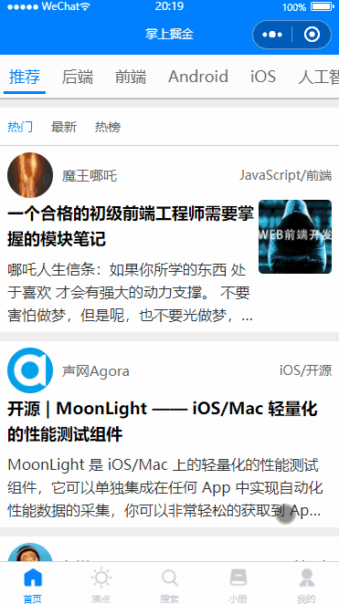
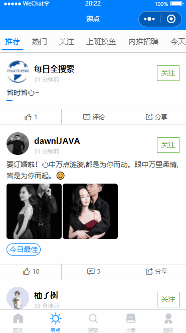
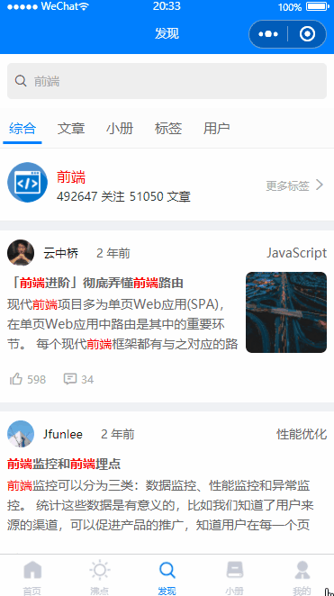
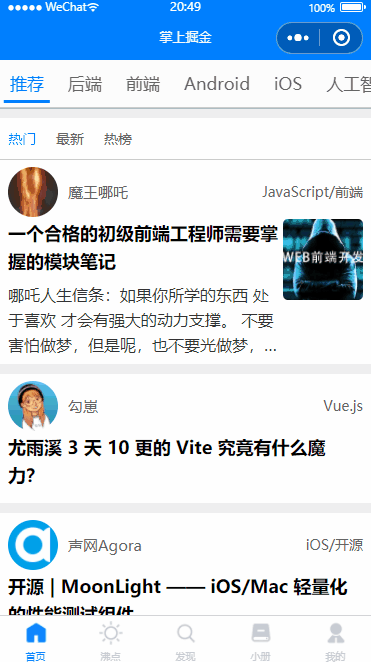

# 教你如何用云开发打造 掌上掘金 -  微信小程序

## 赤兔工作室出品

> 用到的接口大部分还是掘金官网的  如果有侵权 请联系作者

## 我是谁

实话实说： 前端架构师，拥有全栈开发能力，可以独立开发项目，经常钻研最新前沿技术（vue3源码等）。

## 我做了什么

下班时间之余，使用微信小程序做了个 `掌上掘金`(还没有完成)，后期完善后会配上一些学习的教程，希望可以帮助更多小伙伴们。

> 文末下方有联系方式 欢迎大伙沟通交流相互提高。我们敬仰大佬，我们不鄙视新人！

## 用到的技术

1. 微信小程序
2. 微信小程序的云开发
   1. 云函数
   2. 云数据库
   3. 云存储
3. es6
4. flex
5. we-ui
6. cheerio
7. axios
8. dayjs
9. iconfont
10. 等等

## 效果

### 首页

### 沸点

### 发现

### 个人中心

## 后续的工作

等后续项目基本完成后，会**免费**的分享给大家，后期产出的有 

1. 开源代码
2. 掘金系列文章教程
3. 视频 (这个很耗费时间和精力，主要看自己的时间安排和想要学习的朋友人数)

## 最后

开源不容易，免费不容易。希望多点赞 多点关注 多点动力 。打造良性循环大群体。

## 联系方式

### QQ群

## 微信群

